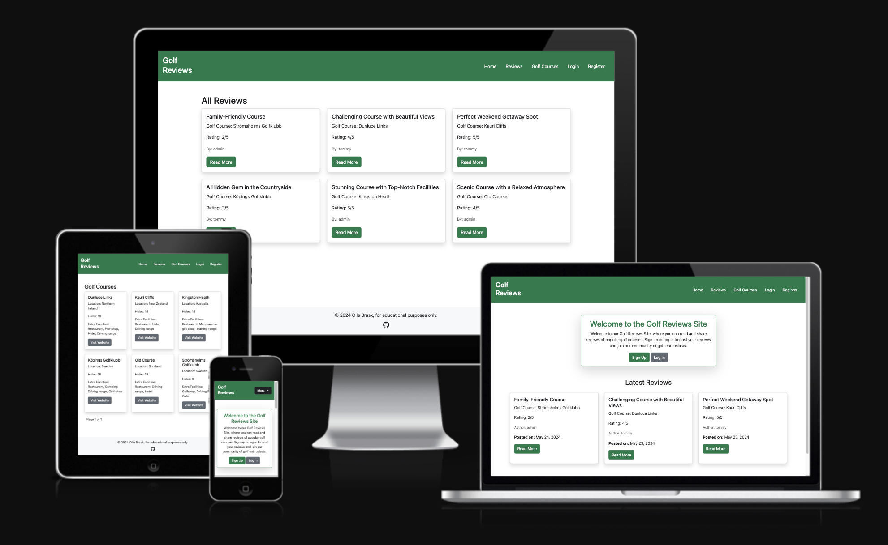
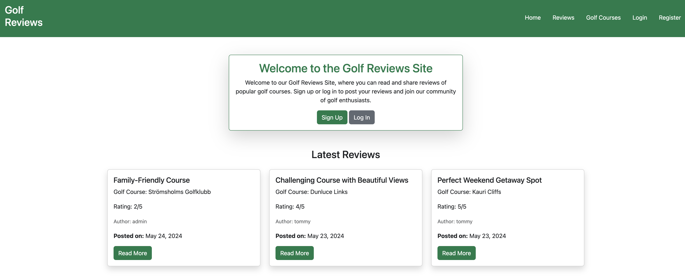
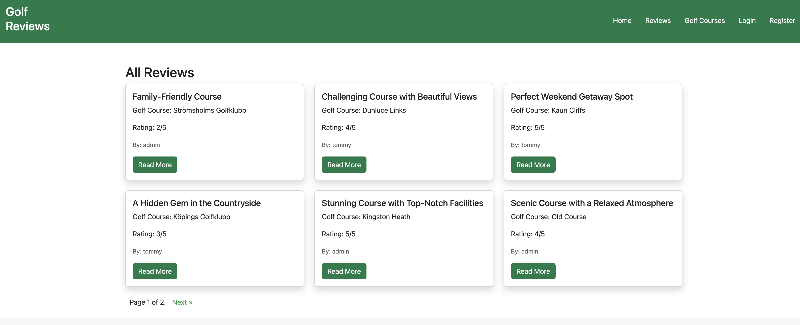
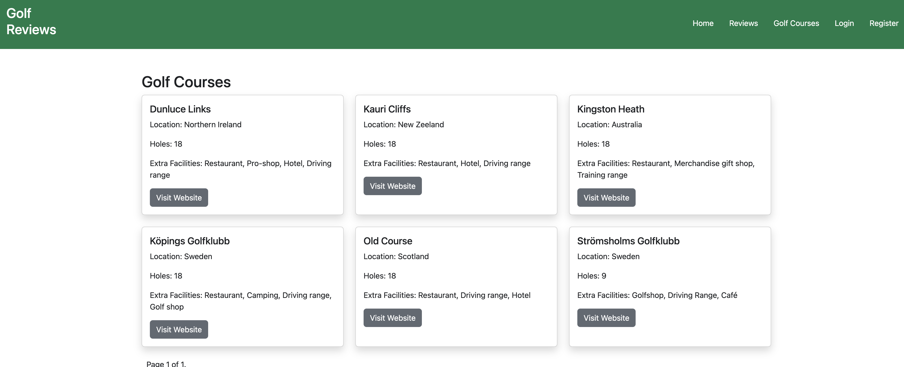
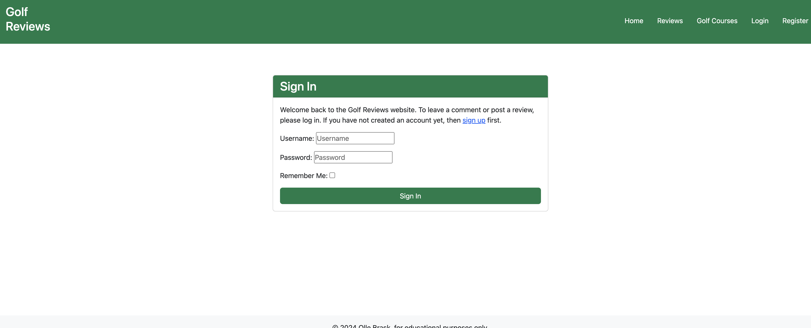
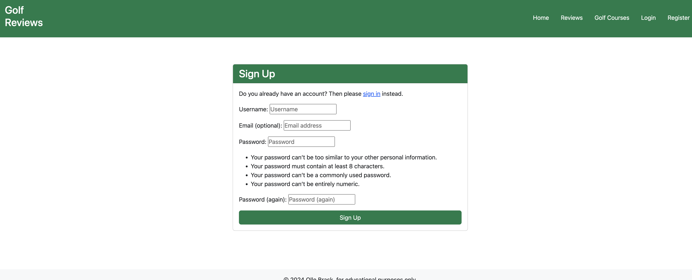
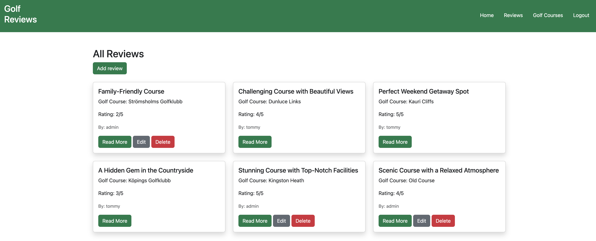
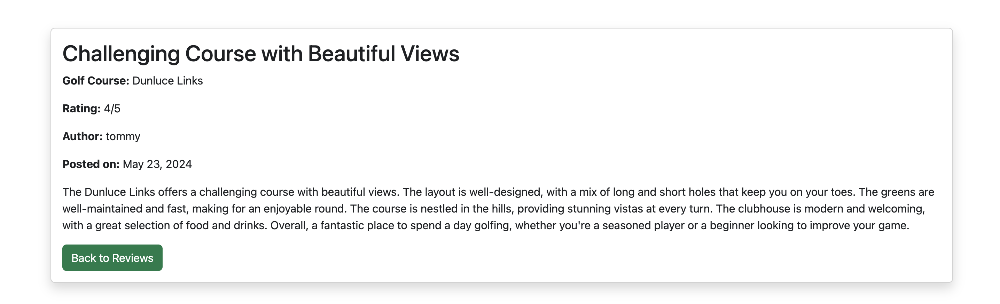
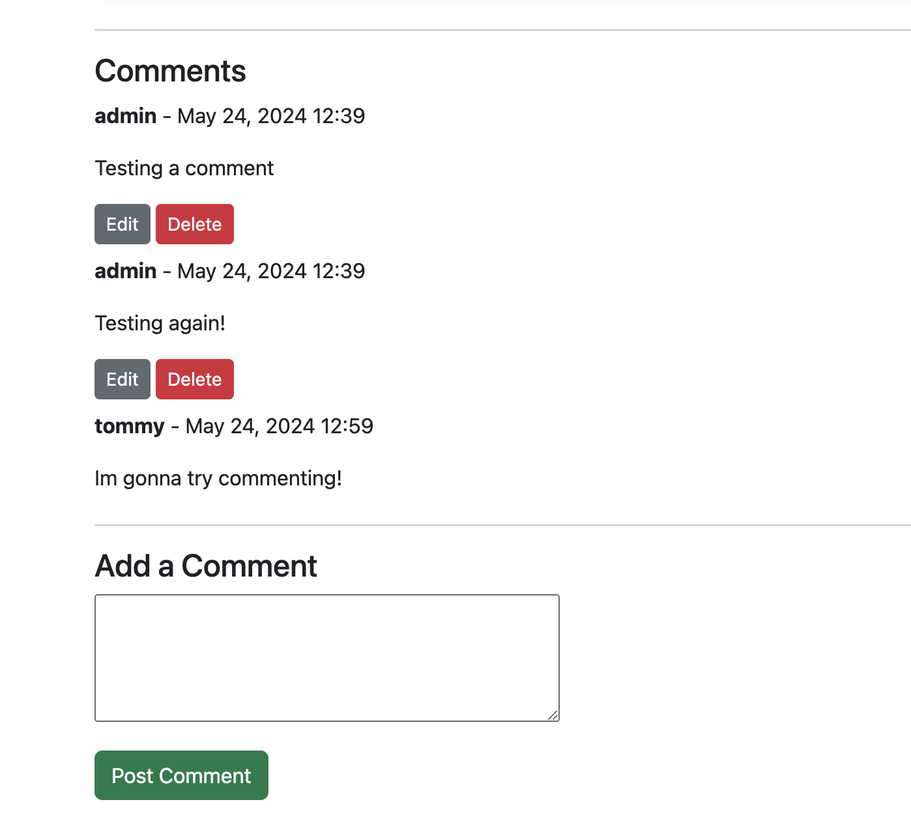
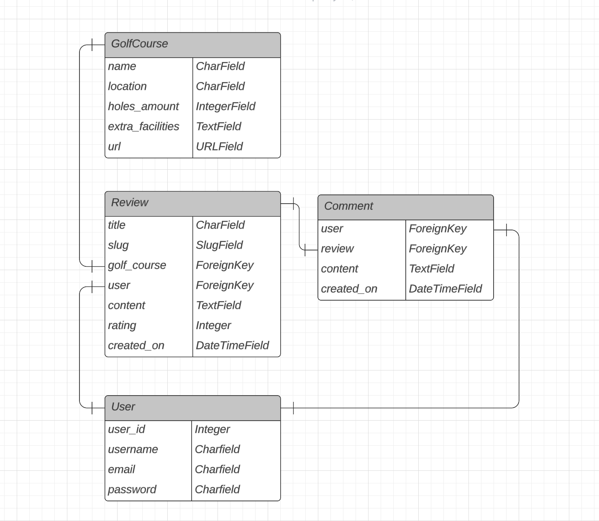

# Golf Reviews



*The link to [Golf Reviews](https://golfreview-blog-6ddabaa03e1e.herokuapp.com/)*

The Golf Reviews site is a place where you can post reviews about a selection of golfcourses.


---
## User Stories

*The link to [User Story Cards GitHub Projects](https://github.com/users/ollebrask/projects/3/views/1)*


  * As a visitor, i want to read interesting golfreviews about popular golfcourses
  * As a visitor, i want to easily navigate through the website.
  * As a registered user, i want post golf reviews and comment other users reviews. 
  * As a superuser, i want to be able to add new golfcourses to the site.


---

## Features
  

Homepage

  
  


 Reviews page

  

 Golfcourses page

  

 Login page 

  

 Register page

  

 Reviews page when logged in (Add reviews shown and edit/delete own reviews)

  

 Review details page

  

 Comments area, under the review details

  

 
---

## Entity-Relationship Diagram

  

* The ERD was created using [Lucidchart](https://www.lucidchart.com/).

---
## Technologies Used

- ### Languages:
    
    + [Python 3.12.2](https://www.python.org/downloads/release/python-3122/): the primary language used to develop the server-side of the website.
    + [JS](https://www.javascript.com/): I didn't write any own JS code, but it is included.
    + [HTML](https://developer.mozilla.org/en-US/docs/Web/HTML): the markup language used to create the website.
    + [CSS](https://developer.mozilla.org/en-US/docs/Web/css): the styling language used to style the website.

- ### Frameworks and libraries:

    + [Django](https://www.djangoproject.com/): python framework used to create all the logic.

- ### Other tools:

    + [Git](https://git-scm.com/): the version control system used to manage the code.
    + [Pip3](https://pypi.org/project/pip/): the package manager used to install the dependencies.
    + [Gunicorn](https://gunicorn.org/): the webserver used to run the website.
    + [Psycopg2](https://pypi.org/project/psycopg2/): the database driver used to connect to the database.
    + [Django-allauth](https://django-allauth.readthedocs.io/en/latest/): the authentication library used to create the user accounts.
    + [Heroku](https://dashboard.heroku.com/): the cloud platform used to host the website.
    + [PostgreSQL from Code Institute](https://dbs.ci-dbs.net/): the cloud database used to store all the data.
    + [GitHub](https://github.com/): used to host the website's source code.
    + [GitPod](https://gitpod.io/): the IDE used to develop the website.
    + [Chrome DevTools](https://developer.chrome.com/docs/devtools/open/): was used to debug the website.
    + [Font Awesome](https://fontawesome.com/): was used to create the icons used in the website.
    + [Favicon](https://favicon.io/) was used for the favicon.
    + [Bootstrap 5.3](https://getbootstrap.com/) was used for style and responsiveness for website.
    + [W3C Validator](https://validator.w3.org/): was used to validate HTML5 code for the website.
    + [W3C CSS validator](https://jigsaw.w3.org/css-validator/): was used to validate CSS code for the website.
    + [CI Python Linter](https://pep8ci.herokuapp.com/): was used to validate Python code for the website.


---
## Bugs

+ **Solved bugs**

1. In review_detail.html the content wasn't rendered as html. When viewed, the user would see paragraph tags before and after the text.

    - I found a filter in django "|safe", i added it to {{ review.content|safe }} and then it was rendered as html.

2. Ive encountered a lot of errors, because of typos. Djangos own debugging has been very helpful, showing exactly what is wrong throughout the whole project.

+ **Unsolved bugs**

None

---
## Testing

Please refer to the [TESTING.md](TESTING.md) file for all test related documentation.

---
## Deployment

- The program was deployed to [Heroku](https://dashboard.heroku.com).

1. Open the repository in GitPod

2. Install the dependencies:

    - Open the terminal window and type:
    - `pip3 install -r requirements.txt`

3. Create a `env.py` file. Add your secret key and database url

    ```python
    import os

      os.environ.setdefault['SECRET_KEY', 'Your secret key']
      os.environ.setdefault['DATABASE_URL', 'Your database url']
    ```


4. Run the following commands in a terminal to make migrations: 
    - `python3 manage.py makemigrations`
    - `python3 manage.py migrate`
5. Create a superuser to get access to the admin environment.
    - `python3 manage.py createsuperuser`
    - Enter the required information (your username, email and password).


### To deploy the project to Heroku:

1.  Login to your account at [Heroku](https://dashboard.heroku.com)

2.	Click "New" to create a new app.

3.	Select a unique name, selected the region, and click Create app.

4.	Within the created app, select the tab, Settings.

5.	At the Config Vars section, click Reveal Config Vars.

6.	Add Config Vars (with their associated values, from env.py):
- `SECRET_KEY`
- `DATABASE_URL`

7. In  `settings.py` file, make sure debug is set to false:

```
DEBUG = False
```

8.	Commit and push to GitHub

9.	Back to Heroku, go to the deployment tab.

10.	Select GitHub as the deployment method and connected to GitHub.

11.	Search for repository name and Connect.

12.	Click Deploy Branch. Click the View button when it is done.

---

## Credits

- [Heroku](https://www.heroku.com/) for hosting the site.
- For tips and help: [Stackoverflow](https://stackoverflow.com)
- Github were used to store my repository: [GitHub](https://github.com)
- Bootstrap Documents [w3schools](https://getbootstrap.com/docs/5.3/getting-started/introduction/)
- Django documentation for learning [Django](https://docs.djangoproject.com/en/5.0/)
- Code Institutes Codestar blog Walkthrough

---
## Acknowledgements

My mentor for valuable feedback! [Iuliia Konovalova](https://github.com/IuliiaKonovalova)