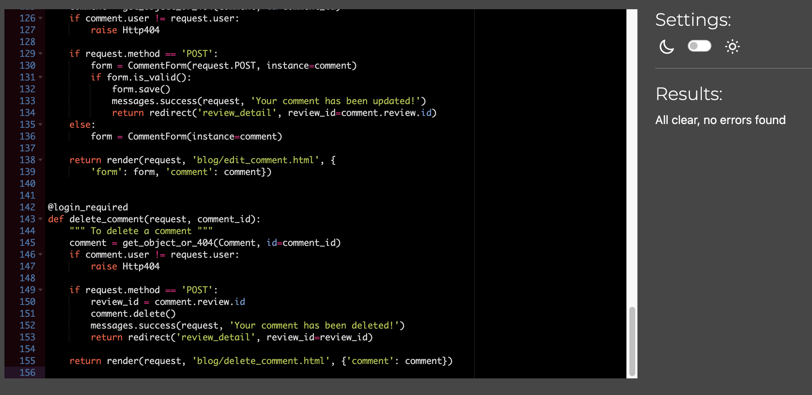
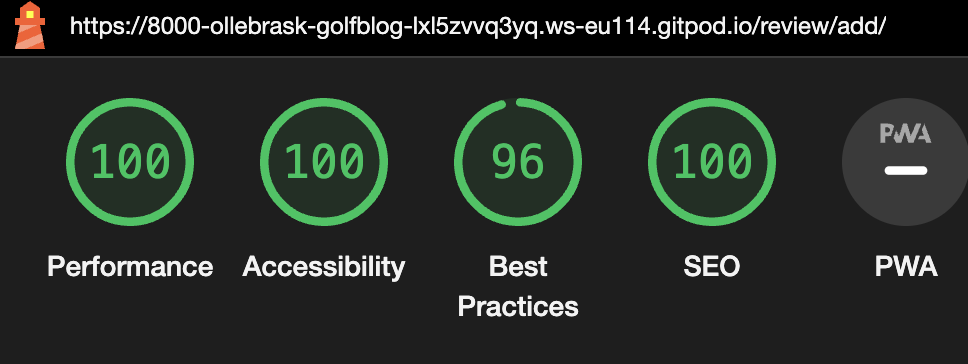

# Testing

## Manual Testing

|     | User Actions           | Expected Results | Y/N | Comments    |
|-------------|------------------------|------------------|------|-------------|
| Sign Up     |                        |                  |      |             |
| 1           | Click on the Register button | Redirected to the sign up page | Y |          |
| 2           | Click on the sign in link in the form | Redirected to login page | Y |          |
| 5           | Enter valid email | Field will only accept email address format | Y |          |
| 10          | Enter valid password | Field will only accept secure passwords | Y |          |
| 11          | Enter valid password confirmation | Field will only accept the same password from the previous field | Y |          |
| 12          | Click on the Sign Up button | Redirected to home page, with succesfully signed in message| Y |          |
| 15          | Click on the Logout butotn | Takes user to sign out page to confirm logout | Y |          |
| 16          | Click "Sign out" button  in the center of the page| Redirects user to home page with you have sign out message | Y |          |
| Log In      |                        |                  |      |             |

---

## Validation:
### HTML Validation:

- No errors or warnings were found when passing through the official [W3C](https://validator.w3.org/) validator. This checking was done manually by copying the view page source code and pasting it into the validator.

#### add_review.html

#### delete_comment.html

#### delete_review.html

#### edit_comment.html

#### edit_review.html

#### index.html

#### review_detail.html

#### show_golfcourses.html

#### add_review.html

### CSS Validation:

- 

- No errors or warnings were found when passing through the official [W3C (Jigsaw)](https://jigsaw.w3.org/css-validator/#validate_by_uri) validator.

### Python Validation:

- No errors were found when the code was passed through CI Python Linter[online validation tool](https://pep8ci.herokuapp.com/).  This checking was done manually by copying python code and pasting it into the validator.

#### admin.py

#### forms.py

#### models.py

#### urls.py

#### views.py

---
## Lighthouse Report

### Home Page

### Reviews Page

### Edit review Page

### Add review Page

### Delete review Page

### Detailed review Page

### Login Page

### Logout Page

### Signup Page

### Edit comment Page

### Delete comment Page

### Golfcourses Page

---

## Compatibility

Testing was conducted on the following browsers;

- Chrome;
- Safari;

---

# Responsiveness

The responsiveness was checked manually by using devtools in (Chrome) throughout the whole development.

---