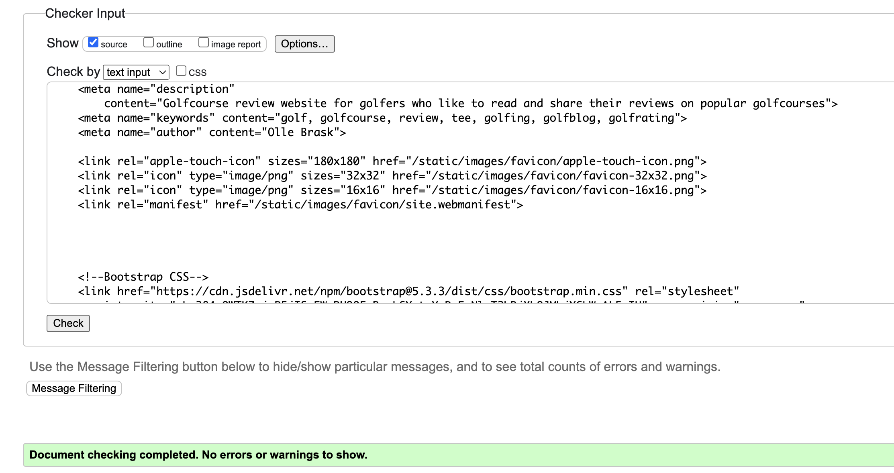

# Testing

## Manual Testing

|     | User Actions           | Expected Results | Y/N | Comments    |
|-------------|------------------------|------------------|------|-------------|
| Sign Up     |                        |                  |      |             |
| 1           | Click on the Register button | Redirected to the sign up page | Y |          |
| 2           | Click on the sign in link in the form | Redirected to login page | Y |          |
| 3           | Enter valid email | Field will only accept email address format | Y |          |
| 4          | Enter valid password | Field will only accept secure passwords | Y |          |
| 5          | Enter valid password confirmation | Field will only accept the same password from the previous field | Y |          |
| 6          | Click on the Sign Up button | Redirected to home page, with succesfully signed in message| Y |          |
| Log In      |                        |                  |      |             |
| 1           | Enter valid username and password | Logged in successfully and redirected to home page | Y |          |
| 2           | Enter invalid username or password | Error message displayed indicating incorrect login details | Y |          |
| Reviews      |                        |                  |      |             |
| 1           | Navigate to home page | List of latest reviews displayed in card format | Y |          |
| 2           | Click on "Read more" under a review | Redirected to review detail page with full review details | Y |          |
| 3           | Click on Reviews button | List of reviews displayed in card format | Y |          |
| 4          | Click on "Read more" under a review | Redirected to review detail page with full review details | Y |          |
| 5          | Click on "Edit" button under a review | Redirected to Edit review page | Y | Edit button only visual for users own reviews |
| 6          | Click on "Update review" button | Review updated and redirected to review detail page| Y |          |
| 7          | Click on "Delete" | Redirected to delete review page | Y | Delete button only visual for users own reviews|
| 8          | Click "Delete review" | Review deleted and redirects user to Reviews page | Y |          |
| 9          | Click "Add review" | Redirected to add review page | Y | Add review button only visual if user is logged in |
| 10          | Fill out form and click "Add review" | Review saved and redirected to add review page | Y |          |
| Comments     |                        |                  |      |             |
| 1          | Fill out form and click "Post comment" | Comment posted underneath review | Y | Only visual if logged in |
| 2          | Click on "Edit" button under a comment | Redirected to edit comment page | Y | Edit button only visual for users own comments |
| 3          | Click on "Save changes" | Comment updated and redirected to the review | Y |          |
| 4          | Click on "Delete" button under a comment | Redirected to delete comment page | Y | Delete button only visual for users own comments |
| 5          | Click on "Delete" confirmation button  | Comment deleted and redirected to the review | Y |          |
| Logout     |                        |                  |      |             |
| 1          | Click on "Logout" button  | Redirected to a confirmation page | Y | Logout button only visual if you are logged in |
| 2          | Click on "Sign out" confirmation button  | Logged out and redirected to home page with sign out confirmation | Y |          |

---

## Validation:
### HTML Validation:

- No errors or warnings were found when passing through the official [W3C](https://validator.w3.org/) validator. This checking was done manually by copying the view page source code and pasting it into the validator.

#### add_review.html

#### delete_comment.html

#### delete_review.html

#### edit_comment.html

#### edit_review.html

#### index.html

#### review_detail.html

#### show_golfcourses.html

#### add_review.html

### CSS Validation:

- 

- No errors or warnings were found when passing through the official [W3C (Jigsaw)](https://jigsaw.w3.org/css-validator/#validate_by_uri) validator.

### Python Validation:

- No errors were found when the code was passed through CI Python Linter[online validation tool](https://pep8ci.herokuapp.com/).  This checking was done manually by copying python code and pasting it into the validator.

#### admin.py

#### forms.py

#### models.py

#### urls.py

#### views.py

---
## Lighthouse Report

### Home Page

### Reviews Page

### Edit review Page

### Add review Page

### Delete review Page

### Detailed review Page

### Login Page

### Logout Page

### Signup Page

### Edit comment Page

### Delete comment Page

### Golfcourses Page

---

## Compatibility

Testing was conducted on the following browsers;

- Chrome;
- Safari;

---

# Responsiveness

The responsiveness was checked manually by using devtools in (Chrome) throughout the whole development.

---